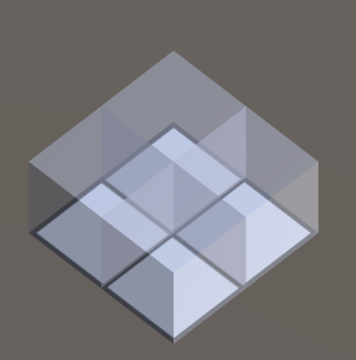
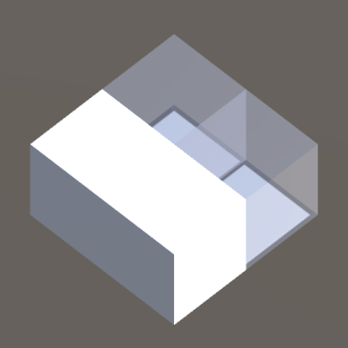
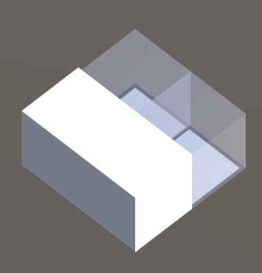
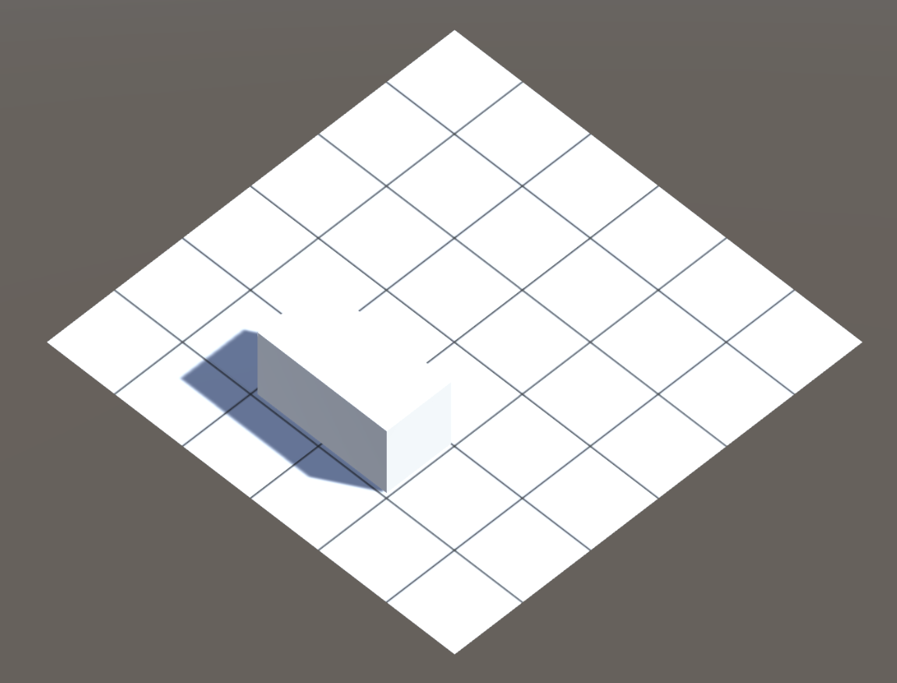

# FoxTestProject
## Это панель создания блоков

## ЛКМ, чтобы добавить/убрать куб из блока

## ПКМ, чтобы "материализовать фигуру. Визуально слегка увеличится в размерах

## Зажать на фигуре ЛКМ и перетащить на игровую сетку.

